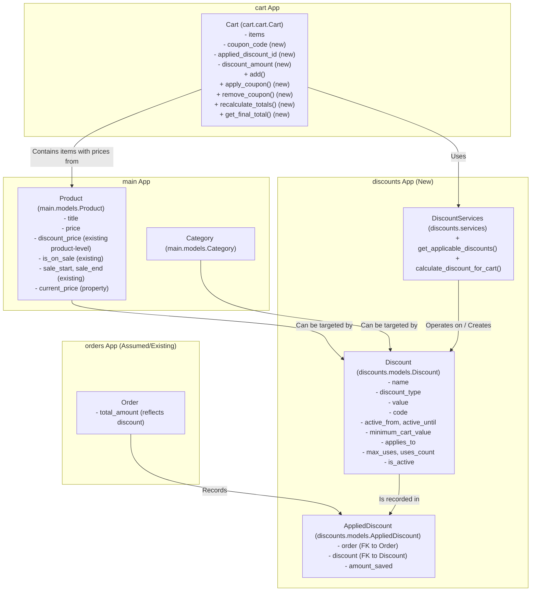

# Discount Section Refactoring Plan

This document outlines the plan to refactor the discount system in the Django e-commerce project. The primary goal is to add new features like coupon codes and percentage discounts for the entire cart, making the system more versatile.

## Current System Overview

Based on the review of:
*   [`main/models.py`](main/models.py)
*   [`cart/cart.py`](cart/cart.py)
*   [`main/views.py`](main/views.py)
*   [`algorithm_discount.txt`](algoritm_discount.txt) (as a guide/example)

The current discount system is:
*   **Product-specific:** Discounts are tied directly to individual products using fields like `discount_price`, `is_on_sale`, `sale_start`, and `sale_end` in the `Product` model.
*   **Applied at item addition:** The `Cart` class stores the `product.current_price` (which considers the sale status) when an item is added.
*   **Lacking advanced features:** No apparent support for coupon codes, order-level percentage/fixed discounts, or other advanced discount types.

## Refactoring Goals

*   Implement a comprehensive discount system with features like coupon codes, percentage discounts for the entire cart, or category-wide sales.
*   Make the discount system more flexible and easier to extend in the future.

## Proposed Plan

### Phase 1: Core Discount Infrastructure

1.  **Define New Discount Models:**
    *   Create a new Django app: `discounts`.
    *   Inside `discounts/models.py`:
        *   **`Discount` Model:**
            *   `name`: CharField (e.g., "Summer Sale 10%", "WELCOME20 Coupon")
            *   `discount_type`: CharField (choices: 'PERCENTAGE', 'FIXED_AMOUNT')
            *   `value`: DecimalField (actual discount amount or percentage)
            *   `code`: CharField (for coupon codes, unique, blank=True, null=True)
            *   `active_from`: DateTimeField
            *   `active_until`: DateTimeField (blank=True, null=True)
            *   `minimum_cart_value`: DecimalField (optional)
            *   `applies_to`: CharField (choices: 'ENTIRE_ORDER', 'SPECIFIC_PRODUCTS', 'SPECIFIC_CATEGORIES')
            *   `products`: ManyToManyField to `main.Product` (if `applies_to` is 'SPECIFIC_PRODUCTS')
            *   `categories`: ManyToManyField to `main.Category` (if `applies_to` is 'SPECIFIC_CATEGORIES')
            *   `max_uses`: PositiveIntegerField (optional, for limiting total uses)
            *   `uses_count`: PositiveIntegerField (default=0, tracks usage)
            *   `is_active`: BooleanField (default=True)
        *   **`AppliedDiscount` Model:**
            *   `order`: ForeignKey to `Order` model
            *   `discount`: ForeignKey to `Discount` model
            *   `amount_saved`: DecimalField

2.  **Admin Interface for Discounts:**
    *   In `discounts/admin.py`, register `Discount` and `AppliedDiscount` models for easy management via the Django admin panel.

### Phase 2: Cart and Discount Application Logic

3.  **Refactor Cart (`cart/cart.py`):**
    *   Update `Cart` class:
        *   Add `self.coupon_code`: Stores the currently applied coupon code string.
        *   Add `self.applied_discount_id`: Stores the ID of the applied `Discount` object.
        *   Add `self.discount_amount`: Stores the calculated monetary value of the discount applied to the cart.
        *   `add()`: Continues to use `product.current_price`. New discounts apply on cart subtotal.
        *   `get_total_price()` (or new `get_final_total()`): Calculates subtotal, then applies eligible automatic/coupon discounts.
        *   New methods:
            *   `apply_coupon(coupon_code)`: Validates and applies a coupon.
            *   `remove_coupon()`: Clears an applied coupon.
            *   `recalculate_totals()`: Core method to invoke discount logic and update cart's discount state. Called on cart changes or coupon actions.

4.  **Create Discount Application Service (`discounts/services.py`):**
    *   `get_applicable_discounts(cart, user=None)`: Finds active automatic and coupon-based discounts meeting conditions.
    *   `calculate_discount_for_cart(cart, discount_code=None)`:
        *   Calculates cart subtotal.
        *   Applies `discount_code` if provided and valid.
        *   Checks for automatic discounts if no code or code is invalid.
        *   Handles discount stacking/precedence (initially, one cart-level discount).
        *   Returns discount amount, final total, and applied `Discount` object.

### Phase 3: User Interface and Experience

5.  **Update Views:**
    *   **Cart Views (`cart/views.py` - to be created/updated):**
        *   `cart_detail(request)`: Displays cart items, subtotal, applied discount details, final total. Includes coupon entry form.
        *   `apply_coupon_view(request)`: Handles coupon form POST, calls `cart.apply_coupon()`.
        *   `remove_coupon_view(request)`: Handles coupon removal.
    *   **Checkout Views (e.g., in an `orders` app):**
        *   Use final discounted total from cart for order creation.
        *   Create `AppliedDiscount` record if applicable.
        *   Increment `uses_count` on the `Discount` object.
    *   **Product Views (`main/views.py`):**
        *   Continue using `product.current_price` for product-specific sales.
        *   Potentially display global automatic discount messages.

6.  **Update Templates:**
    *   **New Cart Detail Template (e.g., `templates/cart/cart_detail.html`):**
        *   Display line items, subtotal.
        *   Show applied discount name and amount saved.
        *   Show final total.
        *   Coupon code entry form and "Apply" button.
        *   Link to remove coupon.
    *   **Checkout Templates:** Reflect final discounted price.
    *   **Base/Header Templates:** Potentially display site-wide discount banners.

### Visual Plan (Mermaid Diagram)

### Key Considerations

*   **Discount Stacking:** Initially, implement a rule that only one cart-level discount (automatic or coupon) can be active at a time. Complex stacking can be a future enhancement.
*   **Clarity of Application:** Product-level discounts (via `current_price`) apply first to item prices. Cart-level discounts then apply to the subtotal of these (potentially already-discounted) items.
*   **User Experience:** Clearly communicate discounts to the user on product pages, in the cart, and during checkout.